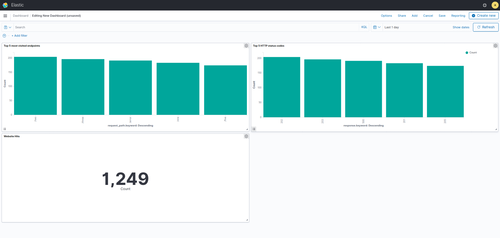

## ТЗ 
1. Опишите docker-контейнеры для flask-приложения, развёрнутого с помощью Gunicorn, Fluentd, Elasticsearch и Kibana.
2. Во flask-приложении опишите шесть роутов (/one, /two, ..., /five, /error, где роуты возвращают HTTP-коды состояния 201, 202, ..., 205, 500 соответственно).
3. Опишите:
   * конфиг логов для gunicorn.access, чтобы они писали в stdout-приложения;
   * конфиг для Fluentd, чтобы он забирал логи из stdout-контейнеров и передавал в Elasticsearch;
   * шаблон для обработки gunicorn.access-логов при помощи [fluentd grok plugin](https://github.com/fluent/fluent-plugin-grok-parser).
4. Постройте дашборд на основе данных из логов gunicorn.access.
5. Отобразите три графических компонента:
   * топ-5 самых посещаемых эндпоинтов;
   * счётчик посещений сайта;
   * топ-5 кодов состояния HTTP.

## Реализация
Описан docker compose, содержащий контейнер для поднятия сервера gunicorn и flask-приложения и контейнеры EFK стека

Запуск

`docker compose up`

Запросы на flask

`python3 app/http_client.py`

Kibana [kibana-local](http://localhost:5601)

